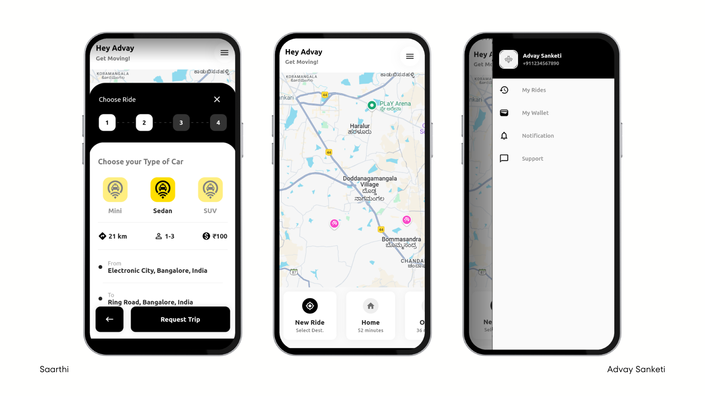

# 🚗 Saarthi - Carpooling App with Real-Time Tracking & Smart Matching

**Saarthi** is a modern carpooling app that connects passengers with drivers based on shared routes and schedules. With features like **real-time tracking, secure payments, in-app messaging, and blockchain-powered trust**, Saarthi makes ride-sharing **safer, more convenient, and cost-effective**.

## 📸 **Screenshots**

---

## 🌟 Features

✅ **Smart Ride Matching** – Finds the best carpool based on location & timing.  
✅ **Live GPS Tracking** – Track your ride in real time for safety & convenience.  
✅ **Secure Payment System** – Seamless fare splitting & transactions.  
✅ **In-App Messaging** – Chat with co-riders for smooth coordination.  
✅ **Blockchain-Powered Trust** – Secure & transparent transaction logging.

## 🛠 Tech Stack

- **Frontend:** Flutter & Dart (Cross-platform mobile app)
- **Backend:** Python + FastAPI (Ride matching, payments, messaging)
- **Database:** PostgreSQL (Stores ride & user data)
- **Blockchain:** Ethereum / Hyperledger (For ride & payment logs)
- **GPS & Tracking:** Mapbox API + WebSockets (Low-latency real-time tracking)

## 📌 How It Works

1. **Match Rides** – Find nearby drivers/passengers with similar routes.
2. **Confirm & Pay** – Secure payments with blockchain-backed records.
3. **Track in Real Time** – GPS-based live tracking for safety & reliability.
4. **Ride & Rate** – Automatic trust scores ensure a safe carpooling experience.

---

## 🌟 Contributing

Feel free to fork this repo and submit a pull request! Any improvements are welcome.

---

## 📜 License

This project is licensed under the GPL-3.0 License. Feel free to use and modify it as you like.

---

## ⭐ Connect

👨‍💻 GitHub: [@AdvaySanketi](https://github.com/AdvaySanketi)
